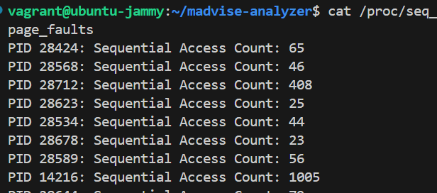
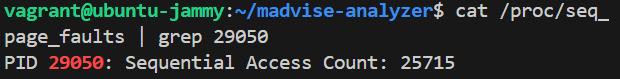

# Smart-Madvise
A kernel module to replace sys call madvise and make it smarter

## Env
- ubuntu 22.04 
- kernel version 6.5.0.41-generic

## Files
- smart-madvise-kprobe.c: the verison that uses kprobe API to implement 
- smart-madvise-syscalltable.c: the version that uses sys_call_table ABI to implement (deprecated)

## Usage & Docs
reference: [https://ipads.feishu.cn/docx/EWLydWFgxo8goqxvVPscdO86nMT?from=from_copylink](https://ipads.feishu.cn/docx/EWLydWFgxo8goqxvVPscdO86nMT?from=from_copylink)


### Smart Madvise Collector

The Smart Advise Analyzer is designed to collect memory information which will later be utilized by the Smart Madvise Daemon to make decisions on the type of advice to provide via `madvise`. Currently, it supports:
1) Gathering sequential page faults data to identify memory access patterns.

This data collection is facilitated by attaching to the `handle_mm_fault` function in the kernel using kprobes, allowing for detailed tracking of memory interactions. Results are written to a `/proc` file, specifically `/proc/seq_page_faults`, where each line contains a PID and its corresponding count of sequential page faults.


### Building and Installation

```bash
sudo make build-collector
sudo make install-collector
sudo make remove-collector
sudo make clean-collector
```
#### Testing

To test this module, use this excellent madvise [benchmarks](https://github.com/exabytes18/mmap-benchmark/tree/master/madvise-benchmark)  which simulates different memory access patterns:

- **Sequential Access**: A benchmark that simulates sequential data access, which should result in a significant number of sequential page faults being logged.
- **Random Access**: A benchmark that simulates random data access, typically resulting in fewer sequential page faults, if any.

Clone the repo, build by `sudo make` command and run these benchmarks with specified arguments:
- For sequential access: `./sequential-access-benchmark 1gb 1` where '1gb' is the file size and '1' is the number of passes.
- For random access: `./random-access-benchmark 1gb 2 1` where '1gb' is the file size, '2' the number of threads, and '1' the number of passes.

#### Monitoring Page Faults

After running the benchmarks, identify the process ID (PID) using a system monitoring tool such as `htop`. Then, filter the logged page faults for this PID from the proc file. For sequential accesses, expect to see a large count of sequential page faults. For random accesses, the PID might not appear if no sequential reads occur.


..
